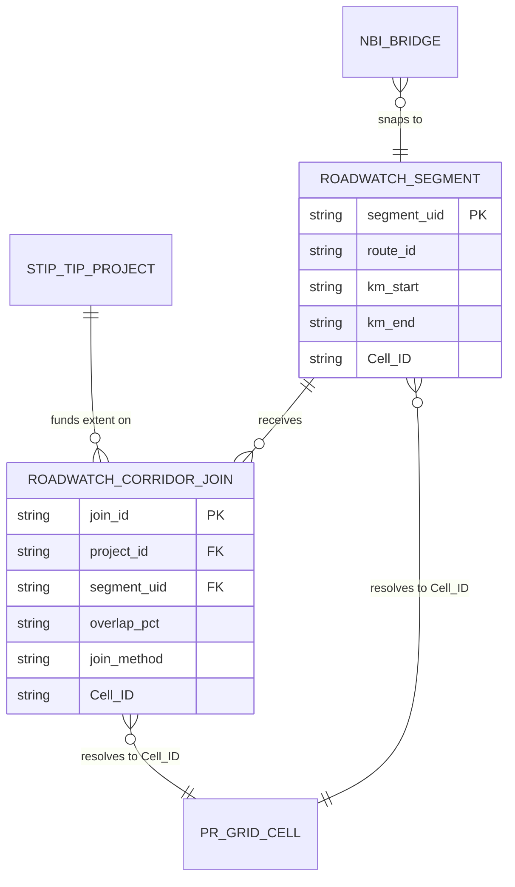
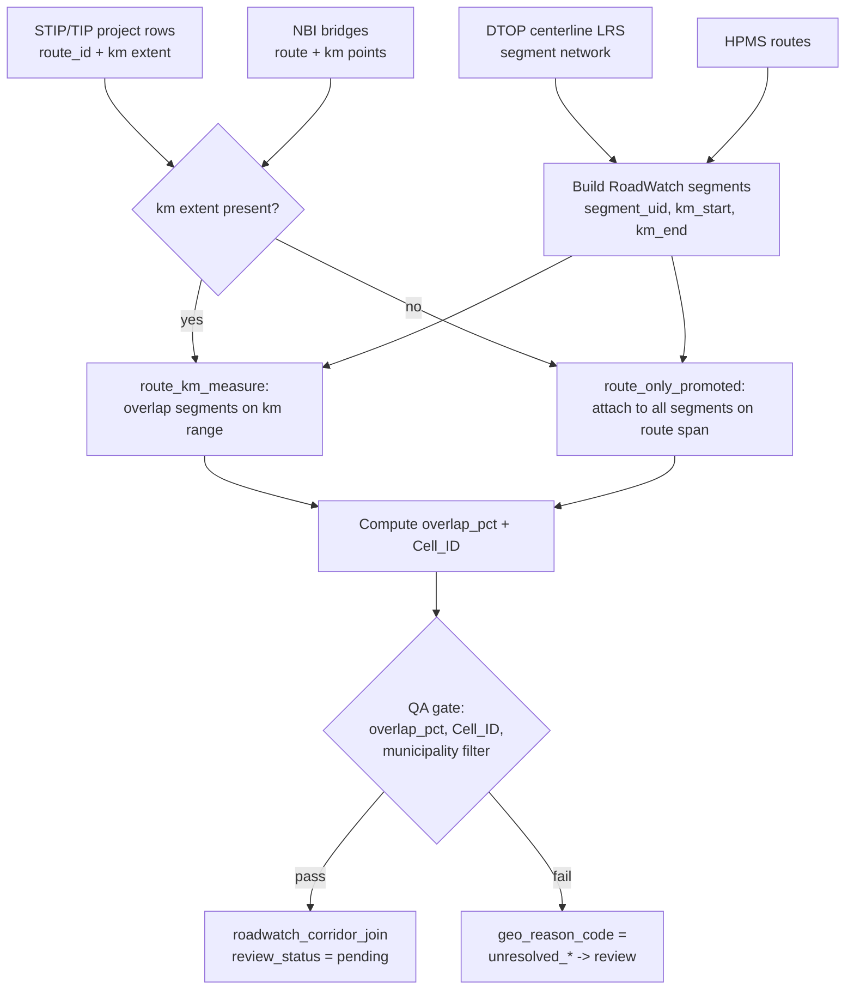

# RoadWatch Corridor Mapping

**Status:** producers implemented and sources registered; **no data ingested yet** (the manual sources await operator exports, the live-fetch sources await egress, and every row still needs a resolved `Cell_ID` — see §5)
**Version:** v1 · 2026-07-07
**Schemas:** [`schemas/roadwatch_segment.schema.json`](../schemas/roadwatch_segment.schema.json), [`schemas/roadwatch_corridor_join.schema.json`](../schemas/roadwatch_corridor_join.schema.json)
**Registry:** promoted into [`registries/source_registry.yaml`](../registries/source_registry.yaml) (the historical overlay definition is retained at [`registries/source_registry_overlays/roadwatch_corridor_mapping.yaml`](../registries/source_registry_overlays/roadwatch_corridor_mapping.yaml), which is no longer authoritative)
**Templates:** [`examples/roadwatch_segment_template.csv`](../examples/roadwatch_segment_template.csv), [`examples/roadwatch_corridor_join_template.csv`](../examples/roadwatch_corridor_join_template.csv)

---

## 1. Purpose & scope

Map **federally-funded roadway projects** onto a **RoadWatch roadway-segment
network** so that route-level project records (STIP/TIP tables, bid plans) become
precise, segment-level joins with QA and confidence metrics.

The deliverable in this document is a **design + schema package**, following the
repo convention set by
[`docs/canonical_entity_relationship_model_v1.md`](canonical_entity_relationship_model_v1.md)
and [`docs/award_schema.md`](award_schema.md): the data model, ID conventions,
source acquisition, join workflow, QA rules, and failure modes are specified here;
the producer scripts are implemented in a later PR against real source artifacts.

**In scope (this package):** the RoadWatch segment schema, the corridor-join
candidate ledger schema, the source-registry overlay for the upstream inputs, and
header-only CSV templates.

**Out of scope (deferred):** producer/ingest scripts, the `run_all.py` step, and
any live data. Cross-repo geometry ownership and Hub-side correlation are also
deferred — see §8.

### Relationship to the baseline grid and federation boundary

Per [`docs/SPATIAL_OVERLAY_JOIN_RULES.md`](SPATIAL_OVERLAY_JOIN_RULES.md) and
[`docs/SPATIAL_BASELINE_GRID.md`](SPATIAL_BASELINE_GRID.md), all Puerto Rico
geography resolves to the canonical **`Cell_ID`** baseline grid
(`registry/spatial/pr_grid_full_cell_index_saturated.csv`, 98,304 cells) before
cross-repo promotion. RoadWatch is an **infrastructure (transport) geography**
overlay in that hierarchy: every segment and every join must carry `Cell_ID`
(non-empty) to be promotable. The road *segment geometry* itself most naturally
originates from the spatial producer (`spiderweb-pr`), and the project↔segment
correlation is ultimately a Hub concern; this package keeps MoneySweep's
producer-side responsibility — the funded projects and the candidate ledger — and
leaves those cross-domain steps to §8.

---

## 2. Authoritative data sources

Each input is registered in
[`registries/source_registry.yaml`](../registries/source_registry.yaml).
Acquisition summary:

| `source_id` | Role | Access method | Key fields to capture |
|---|---|---|---|
| `dtop_centerline_lrs` | Segment geometry + km stationing | DTOP/ACT export (operator drop) | `route_id`, `km_start`, `km_end`, `direction`, geometry, `crs` (often EPSG:32161) |
| `fhwa_hpms_routes` | Secondary route geometry | FHWA ArcGIS REST (`geo.dot.gov`) | `route_id`, measures, geometry, `crs` |
| `fhwa_nbi_bridges` | Bridge point structures | FHWA NBI ASCII/CSV download | structure id, `route_id`, km/measure, lat/long |
| `stip_tip_projects` | Project tables / bid plans | DTOP PDF (Tabula/Camelot parse) | `project_id`, `project_name`, `route_id`, km extents, `funding_program`, `amount`, `municipality` |
| `roadwatch_corridor_join` | Derived join ledger | `build_*` producer (`depends_on` the four above) | full ledger row (§3.2) |

Provenance for anything crossing the federation boundary follows
[`schemas/moneysweep_source.schema.json`](../schemas/moneysweep_source.schema.json)
(`src_[a-f0-9]{32}`, `lineage.producer_script` / `producer_phase` /
`source_inputs[]`).

---

## 3. Data model

Two staging tables. Both follow the permissive "staging row" style of
[`schemas/infrastructure_projects.schema.json`](../schemas/infrastructure_projects.schema.json):
values carried as **strings**, `additionalProperties: true`, `evidence_tier` +
`confidence` provenance columns. `Cell_ID` is spelled exactly as in the baseline
grid so it round-trips through the join hierarchy.

### 3.1 `roadwatch_segment`

The RoadWatch segment network. Primary key `segment_uid`.

| Field | Purpose |
|---|---|
| `source_id`, `source_file` | Provenance of the row |
| `segment_uid` | Stable segment id (see §4) |
| `route_id`, `route_class` | Route identity and class (`interstate`/`us`/`pr_primary`/…) |
| `direction` | Direction the segment represents (`NB`/`SB`/`both`/…) |
| `km_start`, `km_end`, `length_km` | LRS stationing in kilometres |
| `municipality` | Dominant municipio (many-to-many at boundaries) |
| `Cell_ID` | Baseline-grid cell (empty until spatial join) |
| `geometry_ref`, `crs` | Reference into the LineString layer + source CRS |
| `raw_text_excerpt`, `evidence_tier`, `confidence` | Evidence |

### 3.2 `roadwatch_corridor_join`

The corridor-join **candidate ledger** — conceptually the
`AUTHORITATIVE_CORRIDOR_JOIN_LEDGER` of the brief, named in the repo's
`snake_case` convention. Modelled on the `legislative_fiscal_link_candidates`
link-candidate ledger (producer
[`scripts/build_legislative_links.py`](../scripts/build_legislative_links.py)):
each row is a **manual-review candidate** until accepted. Primary key `join_id`.

| Field | Purpose |
|---|---|
| `source_id`, `source_file` | Provenance |
| `join_id` | Deterministic project↔segment pair id (see §4) |
| `project_id`, `project_name` | Roadway project (FK to the STIP/TIP project row) |
| `segment_uid` | Joined segment (FK to `roadwatch_segment`) |
| `route_id` | Route the project references |
| `km_start`, `km_end` | Project extent along the route LRS; **optional** — blank for `route_only_promoted` / `nbi_structure_point` (no project extent) |
| `overlap_pct` | % of the segment covered by the project extent (primary QA metric) |
| `join_method` | How the join was made (vocabulary below) |
| `geo_reason_code` | Spatial-resolution quality/reason code (§3.3) |
| `Cell_ID` | Baseline-grid cell; non-empty required for promotion |
| `municipality`, `funding_program`, `amount` | Context |
| `evidence_tier`, `confidence`, `review_status` | Evidence + `accepted`/`pending`/`rejected` |
| `raw_text_excerpt` | Verbatim support |

**`join_method` vocabulary**

| Value | Meaning |
|---|---|
| `route_km_measure` | Project stated route + km extent; placed by LRS measure |
| `spatial_overlay` | Project geometry intersected the segment geometry |
| `route_only_promoted` | Project stated route only; promoted to segment(s) by route span (lower confidence) |
| `nbi_structure_point` | Bridge/structure point snapped to the nearest segment |
| `manual` | Analyst-entered join |

### 3.3 Geo reason codes

`geo_reason_code` follows the **row shape** of
[`schemas/geo_reason_codes.schema.json`](../schemas/geo_reason_codes.schema.json)
(`code`, `kind: geo_resolution_reason`, `description`). Note that the *enumerated
values* are not in that schema — they are the locked resolver vocabulary
`GEO_RESOLUTION_REASONS` in
[`scripts/build_geo_reason_codes.py`](../scripts/build_geo_reason_codes.py), which
regenerates the reference table asserted for exact equality by
[`tests/test_gis_layers.py`](../tests/test_gis_layers.py).

The following RoadWatch codes are **proposed, not yet registered**:
`km_measure_exact`, `km_measure_interpolated`, `route_only_no_km`,
`crs_reprojected`, `boundary_split_multi_cell`, `unresolved_no_geometry`. The
implementation PR (§8) must add them to `GEO_RESOLUTION_REASONS` and regenerate
the reference table so producers and consumers share one vocabulary; until then,
corridor rows using these codes would carry values absent from the locked table.

### 3.4 Entity–relationship (mermaid)



---

## 4. ID conventions

Deterministic, so re-runs are idempotent (same rule the repo uses for
`src_`/`ent_`/… content hashes).

| Id | Rule |
|---|---|
| `segment_uid` | `seg_` + first 16 hex of `sha256(route_id + "|" + km_start + "|" + km_end + "|" + direction)` |
| `join_id` | `cj_` + first 16 hex of `sha256(project_id + "|" + segment_uid)` |

```python
import hashlib


def _uid(prefix: str, *parts: str) -> str:
    key = "|".join(p.strip().lower() for p in parts)
    return prefix + hashlib.sha256(key.encode("utf-8")).hexdigest()[:16]


segment_uid = _uid("seg_", route_id, km_start, km_end, direction)
join_id = _uid("cj_", project_id, segment_uid)
```

---

## 5. Linear-referencing & join workflow

The core problem is **calibrating route-km measures to segment UIDs** and
**promoting route-only projects** to segment-level joins.



**Step 1 — Build the segment network.** Parse the DTOP centerline LRS (HPMS as
secondary) into `roadwatch_segment` rows with km stationing. Reproject to a
single CRS (record it in `crs`) and resolve each segment to `Cell_ID`.

**Step 2 — Stage the projects.** Parse STIP/TIP PDFs (Tabula/Camelot) into
`infrastructure_projects`-shaped rows, capturing `route_id` and km extents where
stated. Document-parsing and GeoPandas/PostGIS are used here as **vocabulary and
design constraints**, per
[`docs/REFERENCE_ARCHITECTURES.md`](REFERENCE_ARCHITECTURES.md) — not as
copy/paste dependencies.

**Step 3 — Join.** For each project:
- if a km extent is present, select segments whose `[km_start, km_end]` overlaps
  the project extent (`route_km_measure`);
- else attach to every segment on the route span (`route_only_promoted`, lower
  confidence);
- bridge-scoped projects snap to the nearest segment via the NBI point
  (`nbi_structure_point`).

**Step 4 — Measure & resolve.** Compute `overlap_pct`, carry `Cell_ID`, set
`geo_reason_code`. Example measure logic in SQL (PostGIS vocabulary):

```sql
-- overlap of project extent [p.km_start, p.km_end] on segment s, as % of segment
SELECT
  s.segment_uid,
  p.project_id,
  100.0 * GREATEST(0,
      LEAST(s.km_end, p.km_end) - GREATEST(s.km_start, p.km_start)
  ) / NULLIF(s.km_end - s.km_start, 0) AS overlap_pct
FROM roadwatch_segment s
JOIN stip_tip_projects p
  ON p.route_id = s.route_id
 AND p.km_start < s.km_end
 AND p.km_end   > s.km_start;
```

**Step 5 — Emit candidates.** Write `roadwatch_corridor_join` rows with
`review_status = pending`; a valid `Cell_ID` on both sides is required before the
row is promotable across repos.

---

## 6. QA & confidence

Reuse the `evidence_tier` / `confidence` conventions from
[`docs/confidence_model.md`](confidence_model.md) and
[`schemas/infrastructure_projects.schema.json`](../schemas/infrastructure_projects.schema.json).

| Check | Rule |
|---|---|
| Overlap | `overlap_pct >= 20` to keep a candidate; `>= 60` eligible for auto-accept review |
| Cell resolution | `Cell_ID` non-empty on segment and join, else `unresolved_*` → review |
| Municipal filter | Segment `municipality` must be consistent with the project's stated municipio; mismatch → review |
| Method weighting | `route_km_measure` > `spatial_overlay` > `nbi_structure_point` > `route_only_promoted` |

Suggested confidence blend (documented, not yet implemented):

```text
confidence = w_method * method_weight
           + w_overlap * (overlap_pct / 100)
           + w_tier   * source_tier_weight
```

Promotion follows the overlay's `promotion_rule: cross_confirmed_only` and
`manual_review_required: true`: candidates stay `pending` until an analyst accepts
them.

---

## 7. Failure modes

| Failure | Symptom | Handling |
|---|---|---|
| No km on project | Route-only project | `route_only_promoted`, `geo_reason_code = route_only_no_km`, low confidence |
| CRS mismatch | Geometry offset after join | Reproject in Step 1; record `crs`; `crs_reprojected` |
| Route id drift | DTOP vs HPMS vs STIP name differently | Maintain a route_id crosswalk; prefer DTOP LRS |
| Segment crosses cell edge | Ambiguous `Cell_ID` | Treat as many-to-many (`boundary_split_multi_cell`) per join rules |
| Missing geometry | Cannot resolve `Cell_ID` | `unresolved_no_geometry` → review; not promotable |
| STIP PDF parse noise | Wrong km/amount | Keep `raw_text_excerpt`; low `evidence_tier`; review |

---

## 8. Downstream / federation posture

This package is producer-side and **registry-driven**: once the producers emit
the ledger into MoneySweep's export streams, TheHub consumes it via its existing
`bridge.py` + `registry/producers.yaml` path with **no Hub code change**. The
project↔geometry **correlation** and any RoadWatch dashboard surface belong to the
Hub (its boundary rule: cross-domain joins live in the Hub), and the segment
*geometry* is expected to originate from the spatial producer. Those steps are
intentionally deferred.

### Build sequence (later PR)

1. Register the four inputs (done here as an overlay); merge into
   `registries/source_registry.yaml` and run `scripts/regenerate_registry_json.py`.
2. Register the proposed geo reason codes (§3.3) in `GEO_RESOLUTION_REASONS`
   (`scripts/build_geo_reason_codes.py`) and regenerate the reference table so
   `tests/test_gis_layers.py` stays green.
3. Implement `scripts/ingest_dtop_centerline_lrs.py` (+ HPMS, NBI, STIP producers).
4. Implement `scripts/build_roadwatch_corridor_join.py` (validates rows via
   `moneysweep.validation.canonical_v1_schema.validate_row`, writes a provenance
   manifest).
5. Add a `--skip-roadwatch*` flag in `moneysweep/orchestrator/cli.py` and a step
   in `run_all.py`, ordered after the `depends_on` inputs.
6. Add `tests/test_roadwatch*.py` mirroring `tests/test_infrastructure_revenue.py`.
